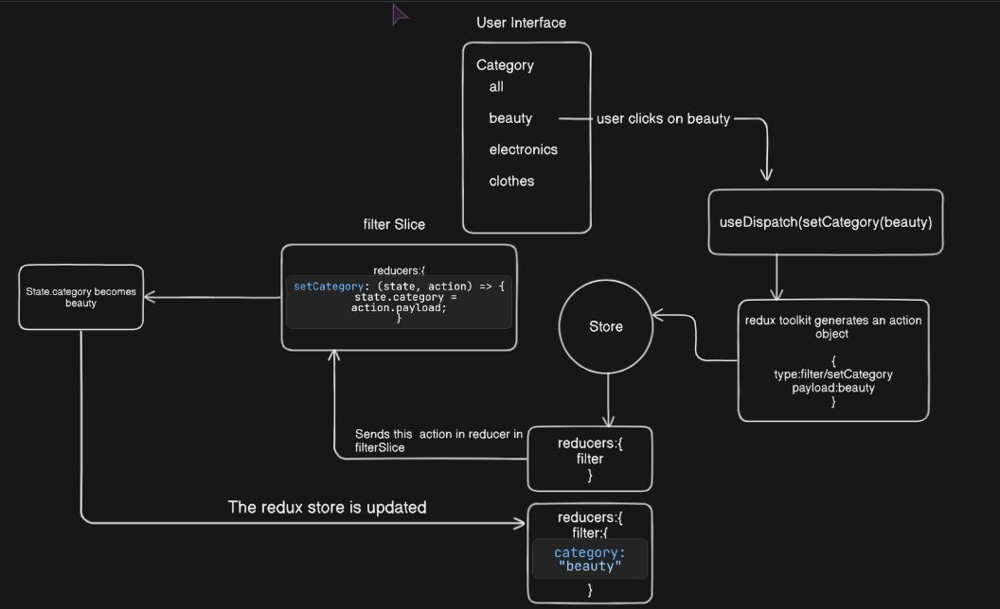

Day 6
REDUX-TOOLKIT-

1. Understanding of the fundamentals of redux , important terminologies like store , action , reducers, slice ,state
2. Learned about how to fetch data in in redux using createAsyncThunk();
3. Redux Developer Tool
4. SSOT,how it reduce prop drilling and the overall workflow
5. Created a simple counter application to practically understand all the concepts.
6. Tried implementing the store apllication using redux toolkit where I implemented
   -Two Slices : ProductListing and for Cart
   -reducers for Cart :addToCart ,removeFromCart,clearTheCart and for Product used createAsyncThunk

   
   Day 7

7. Maintained the folder struggle
8. Added two more reducers in cartSlice for quantity increment and decrement
9. Another feature filterSlice to gets products based on category selected
10. Saw an issue when reloading the website the product present in cart were not persitant
11. Used Middleware to solve the above issue storing the product added to cart in local storage so that it stays persistant which will help for particular logged in user to keep their cart save (not implemented the login page yet)

 {: width="300" height="200"}
